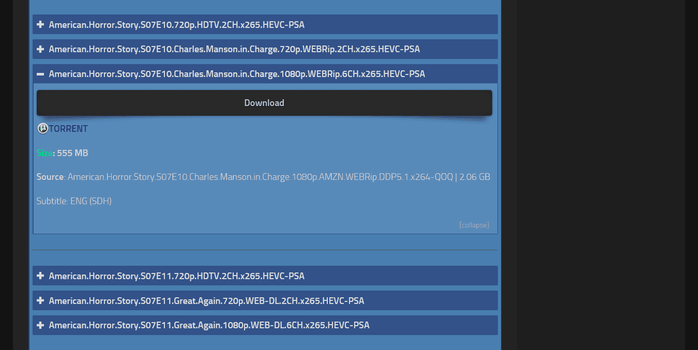
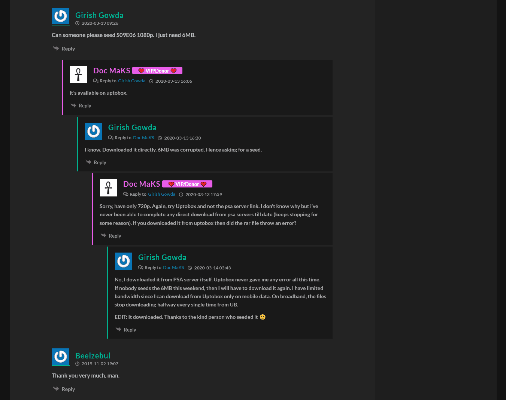
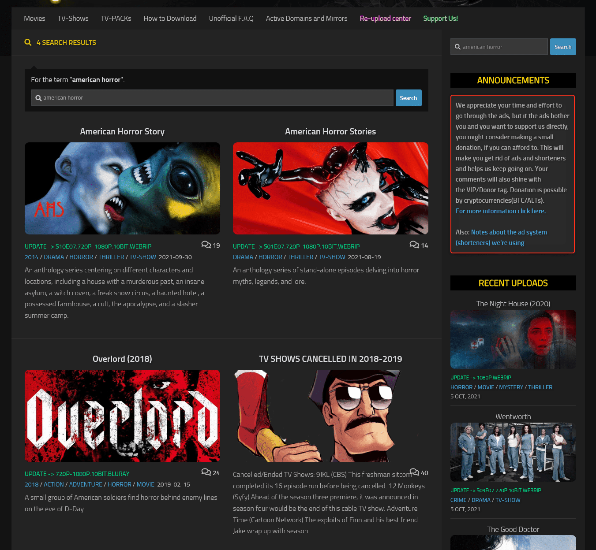

# PSARips-Ash-Dark

Dark mode for PSARips with some tiny layout changes. It completely restyles the website to dark and redesigns some elements to better fit in with the theme. 

## Install and setup
In order to use this theme or any other userstyles you will need to install a browser extension. I recommend using the following.

### Browser extension: 
Stylus - get the addon for: 
* [Firefox](https://addons.mozilla.org/en-US/firefox/addon/styl-us/)
* [Chrome](https://chrome.google.com/webstore/detail/stylus/clngdbkpkpeebahjckkjfobafhncgmne) 
* [Opera](https://addons.opera.com/en-gb/extensions/details/stylus/)

### Install this theme:
Once you have installed the browser extension click on the link below to install this theme.

  >Installs directly from this repository.
  >This is only available using Stylus (see the [documentation](https://github.com/openstyles/stylus/wiki/Usercss)).

## Screenshots
### Homepage

### Movies

### TV Shows

### Posts

### Comments Section

### Search Results

## License
[GNU GPLv3](LICENSE)